# HydraStore: Post-Quantum Secure Distributed Storage Fabric

[]()
[]()
[]()

HydraStore is a zero-trust, self-healing distributed storage system designed to withstand the next generation of cryptographic and infrastructure threats. Built with Go and Docker, it provides high-availability storage with integrated **Post-Quantum Cryptography (PQC)** and autonomous **Self-Healing** capabilities.

## 📐 System Architecture

```mermaid
graph TD
    User([API Client]) -- "1. Upload File" --> GW[Node 1: Gateway]
    GW -- "2. RS-Shard & Encrypt" --> Mesh{Mesh Fabric}
    Mesh -- "3. Distribute Shards" --> N1[Node 1 Storage]
    Mesh --> N2[Node 2 Storage]
    Mesh --> N3[Node 3 Storage]
    Mesh --> N4[Node 4 Storage]
    Mesh --> N5[Node 5 Storage]

    subgraph "Fabric Control Plane"
        Audit[Audit Engine] -.->|Auto-Heal| Mesh
        Gossip[Gossip Protocol] -.->|Sync Metadata| Mesh
    end

    style GW fill:#00f2fe,stroke:#333,stroke-width:2px,color:#000
    style Mesh fill:#15171e,stroke:#00f2fe,stroke-dasharray: 5 5
    style Audit fill:#00ff88,color:#000
```



## 🚀 Key Engineering Pillars

### 1. Quantum-Resistant Security
HydraStore is one of the few distributed fabrics implementing **ML-KEM-768** (formerly Kyber) for peer-to-peer handshakes. This ensures that current encrypted traffic is protected against future decryption by quantum computers (Harvest Now, Decrypt Later protection).

### 2. High-Availability (3+2 Reed-Solomon)
Data is not simply "copied"—it is mathematically sharded. Using a 3+2 erasure coding scheme, every file is split into 3 data shards and 2 parity shards.
*   **40% Fault Tolerance**: The system survives the simultaneous failure of any 2 nodes with zero data loss.
*   **Mathematical Reconstruction**: Lost shards are regenerated in real-time using finite field arithmetic.

### 3. Autonomous Self-Healing
A background **Fabric Audit Engine** constantly monitors mesh health. If a node goes offline, the mesh automatically:
1.  Detects missing shards.
2.  Reconstructs them from surviving peers.
3.  Re-distributes them to healthy nodes to restore 100% redundancy.

### 4. Storage Efficiency (CAS)
Native **Content-Aware Storage (CAS)** deduplicates files at the gateway level. If two users upload the same file under different names, HydraStore stores only one set of shards, significantly reducing infrastructure costs.

---

## 📊 Verified Performance Metrics ( Tested on 65MB video file)
*Extracted from the [Performance Audit Suite](benchmark.ps1)*

| Metric | Measured Value | Analysis |
| :--- | :--- | :--- |
| **Encoding Latency** | **6.7s** | 10MB payload (PQC Handshake + RS-Encoding + AES-GCM) |
| **Recovery Latency** | **5.0s** | Full reconstruction from 60% node availability |
| **Throughput** | **1.6 MB/s** | Distributed write speed across the mesh fabric |
| **Resilience** | **3/5 Nodes** | Quorum maintained during 2-node catastrophic failure |

---

## 🛠️ Quick Start

### Prerequisites
*   Docker & Docker Compose
*   PowerShell (for testing suite)

### Launch the Fabric
```bash
# Spin up the 5-node mesh
docker-compose up -d --build
```

### Run the Deep Audit
```powershell
# Verify deduplication, fault tolerance, and reconstruction
.\test_system.ps1
```

### Access Command Center
Open your browser to `http://localhost:8080` to view the **Real-Time Mesh Heatmap** and storage audit.

---

## 📂 Project Navigation
*   **[ENGINEERING_DESIGN.md](DOCS/ENGINEERING_DESIGN.md)**: Deep dive into the cryptographic and mathematical architecture.
*   **[OPERATIONS_GUIDE.md](DOCS/OPERATIONS_GUIDE.md)**: Full command reference and folder structure.
*   **`server.go`**: Core P2P transport and Self-Healing engine.
*   **`api_server.go`**: High-performance HTTP Gateway and Dashboard.

---
**HydraStore** — *Resilience Through Mathematics. Security Through PQC.*
